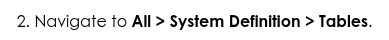
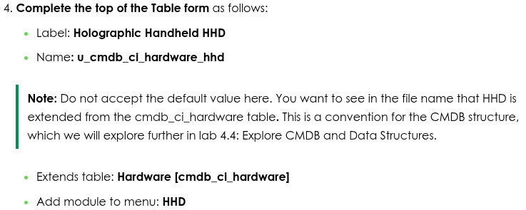
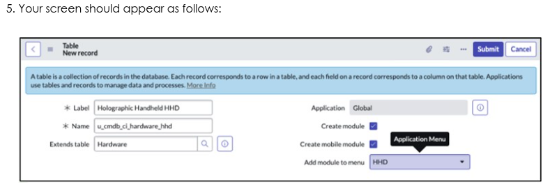
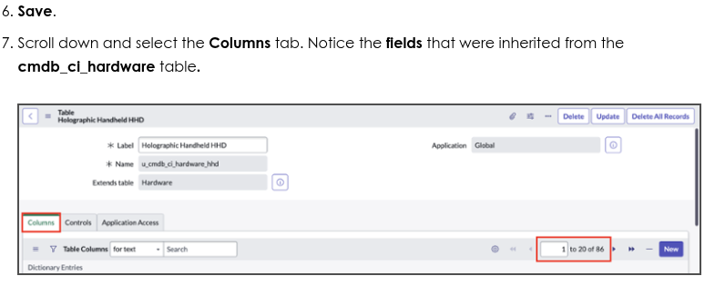
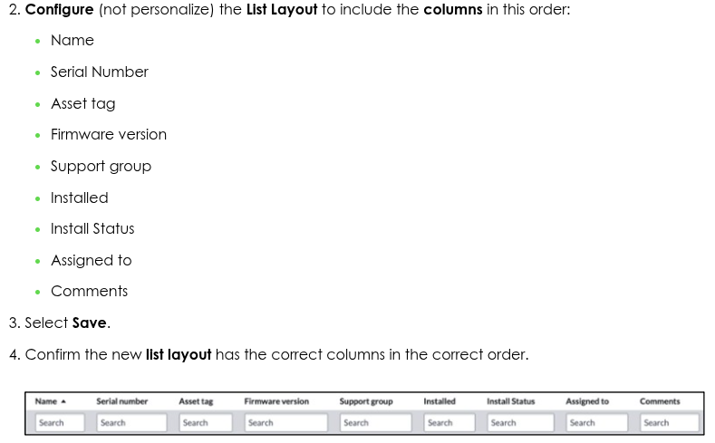

# Module 4: Manage data

## Conteúdo do Módulo

## Objetivos

| # | Objetivo | Descrição |
|---|----------|-----------|
| 1 | Avaliar melhorias solicitadas | Avaliar e implementar novas aplicações e suas customizações conforme as solicitações do negócio |
| 2 | Conhecimento de arquitetura de BD | Demonstrar compreensão profunda da arquitetura do banco de dados ServiceNow e conceitos fundamentais de administração |
| 3 | Utilizar Schema Maps | Aplicar schema maps para mapeamento e transformação de dados entre diferentes estruturas |
| 4 | Controles de acesso | Estabelecer e configurar controles de acesso apropriados em nível de tabelas e campos |
| 5 | Criar conjuntos de importação | Criar e gerenciar import sets para importação de dados no sistema |
| 6 | Utilizar Transform Maps | Aplicar transform maps para transformação e mapeamento de dados durante a importação |
| 7 | Funcionalidade do CMDB | Explicar e demonstrar a funcionalidade central do Configuration Management Database (CMDB) |
| 8 | CI Class Manager | Utilizar o CI Class Manager para examinar a hierarquia de tabelas e atributos do CMDB (all, derived, added) de uma classe dada |
| 9 | Conhecimento de CSDM | Demonstrar compreensão do Common Services Data Model (CSDM) e sua aplicação no ServiceNow |
| 10 | Discovery e Service Mapping | Explicar os conceitos e processos de Discovery e Service Mapping |

## Labs e atividades

### 4.1.1: Criar tabela para configuração de registros HHD

#### Section 1: Create a new table, column and list layout

- Label: Holographic Handheld HHD
- Name: u_cmdb_ci_hardware_hhd
- Extends label: Hardware [cmdb_ci_hardware]

##### Create the firmware version field

##### Configure list layout

#### Section 2: Configure Infinity HHD form

### 4.2.1: Criar controles de acesso
Estabelecer e configurar controles de acesso

### 4.3.1: Importar dados de hardware HHD
Importar dados de hardware HHD no sistema

### 4.4.1: Explorar relacionamentos CMDB e CI
Explorar os relacionamentos entre CMDB e CI

